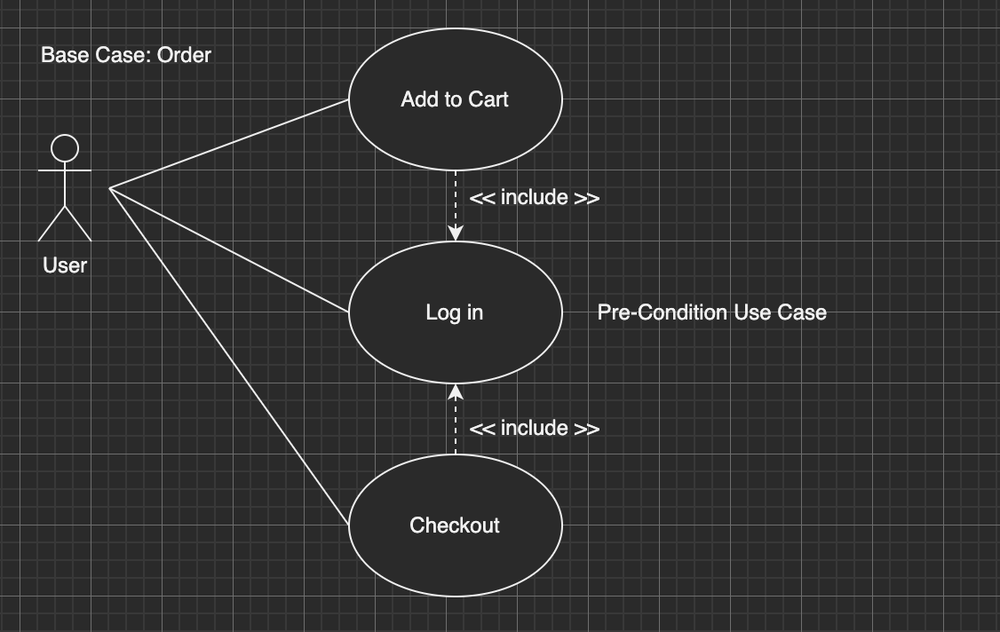
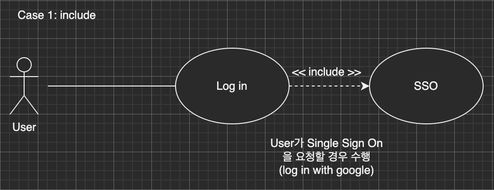
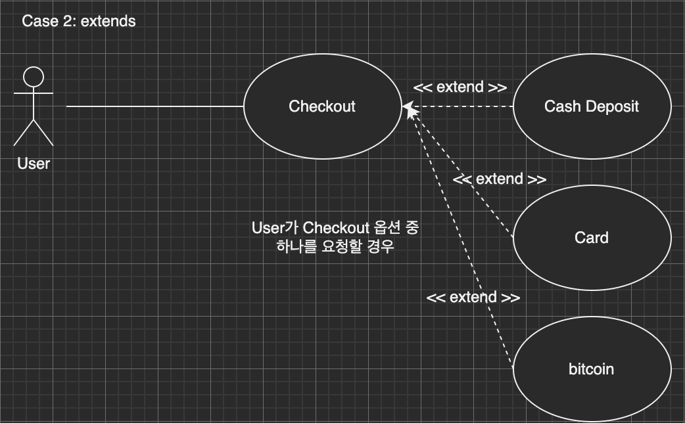

# git, github

## Connect to Frontend

---

<!--
paginate: true
theme: default
size: 16:9
footer : Connect to Frontend,  Wooyoung Choi, 2022
-->

## Software Development Life Cycle

---

### SDLC란?

- 소프트웨어를 계획, 개발, 시험, 배포하는 과정
- 요구사항 분석 -> 설계 -> 구현 -> 테스트 -> 유지 및 보수

---

### Models

- build & Fix: 일단 만들고 고치는.. 지금도 하고 있는..
- Prototype: 최소한의 요구사항 분석 후 프로토타입을 제작하여 고객의 요구를 개발에 적극적으로 도입. 고객 평가가 중요한 프로덕트에 도입하는 모델.
- Waterfall: 요구사항 분석 -> 설계 -> 구현 -> 운용이 순차적으로 진행. 대규모 팀에 적합. 각 단계를 완료하기 전까지 다음 단계로 넘어가지 않음.
- Spiral: 목표설정 -> 위험분석 -> 개발 및 검증 -> 고객평가/다음단계수립 을 반복. 점진적으로 단계를 반복수행하여 위험을 최소화. 대형 시스템 구축에 유리.
- Agile software development

---

### Waterfall


- Plan-driven

---

## Agile Software Development

- 프로젝트의 생명주기동안 반복적인 개발을 촉진하는 개발모델
- TMP(Too Much Plan)과 TLP(Too Less Plan)의 타협
- Code-oriented Methodology
- XP(eXtreme Programming), Scrum 등의 상세 방법론 존재

---

## Agile vs Waterfall


---

## eXtreme Programming


- 고객 중심의 양질의 소프트웨어를 빠른 시간안에 전달한다!
- Business Requirements의 변동이 심한 경우 적합한 개발 방법.
- Test! Test! Test! - Test Driven Development

---

### Key Process - XP

- Role: Project Manager, Technical writer, Interaction Designer, Architect, Tester, Programmer, User(Stakeholder)
- Planning: 2주 주기로 계획을 세우고, 프로토타입을 통해 개발 방향 점검
- Test-Driven Development: Test Code를 먼저 작성하고 기능을 개발한 뒤, 테스트를 통해 검증
- Pair Programming: 2인 이상의 팀을 이뤄 한 명이 Drive 하고, 한명은 QA 또는 Navigator로 참여.

---

## Scrum


- 상호,점진적 개발방법론
- 개발할 기능, 수정사항에 대해 우선순위를 부여한 뒤, 이 순서대로 Task 진행
- 매일 15분의 회의 진행
- 1~4주의 Sprint(기획~리뷰)

---

## Key Process - Scrum

- Role: Product Owner, Scrum Master, Developer
- Product Backlog: 제품 전체의 요구사항
- Planning meeting: Sprint 목표와 Sprint Backlog 계획
- Sprint Backlog
- Daily Scrum: 어제 한 일, 오늘 할 일, Issue 등 공유

---

## Scrum with XP

1. Sprint 주기: 2주(Deadline: 중간발표, 최종발표일)
2. Requirement Analysis -> Design -> Implementation(Scrum with XP)

- Planning Meeting: Sprint 기간 중 구현할 내용계획
- Sprint Backlog 작성(w/ github projects): M/H 추산 및 분배를 통해 Task 분배
- Daily Scrum(어제 한 일, 오늘 할 일, Issue): 매일 일과 시작 전 15분 간
- Test-Driven Development(Optional): 테스트코드 먼저 작성 후 본 코드 작성

---

### Before Implementation(1)

- Requirement Analysis
    - Client
    - Functional
    - External interface
    - ~~Performance~~
- Wireframe, Usecase, Storyboard
- Design Prototype
- ERD(Entity Relationship Diagram)
- API Design

---

### Wireframe


---

### Usecase


---

### Base Use Case



---

### include



---

### extends



---

### Storyboard


---

### Before Implementation(2)

- 요구사항을 분석한다.
- AdobeXD, Sketch, Framer 등의 도구를 이용하여 Design Prototype, Usecase, Storyboard를 구성
- Data Flow, ERD를 작성
- API 기획회의
- API Design
- 기획 발표 PPT 작성

---

### Sprint

- 앞서 분석한 기획안을 바탕으로 Sprint Backlog 작성(w/ github projects)
- Issue 관리와 Communication 동시 수행 가능

#### Daily

- 오전 15분 간 Daily Scrum 진행(어제 한 일, 오늘 한 일, Issue)
- 각자의 Task 진행

---

## Tools for work

- Communication: **Slack**, Discord, Microsoft Teams
- Repository: **Github**, bitbucket, gitlab, ..
- Version management: **git**, Mercurial, Subversion
- Design(Prototyping) Tool: Adobe XD, Sketch, Framer ..
- Diagram Tool: **Drawio**, Microsoft Visio, ..
- Presentation: **Marp**, Keynote, Microsoft Powerpoint, Google Slides, ..

- Documentation: **.md in repository**, Google Docs, .hwp..

---

## 생산된 모든 문서와 코드는 Open 해야 하며, 공유되어야 합니다.

- Team Slack, Documentation, Code, ..

- Repo: README.md, LICENSE, 발표자료, 기획문서

---

## Templates for issue(simple)

`.github/ISSUE_TEMPLATE.md`

```md
## Expected Behavior


## Actual Behavior


## Steps to Reproduce the Problem

  1.
  1.
  1.

## Specifications

  - Version:
  - Platform:
  - Subsystem:
```

---

## [Sane github labels](https://medium.com/@dave_lunny/sane-github-labels-c5d2e6004b63)

|Status|Type|Priority|Scope|
|:--:|:--:|:--:|:--:|
|Accepted|Bug|Critical|Markup|
|Available|Enhancement|High|Style|
|Completed|Maintenance|Low|React|
|In Progress|Question|Medium|Backend|
|On Hold|||iOS|
|Pending|||Android|

---

## Templates for pull request(simple)

`.github/PULL_REQUEST_TEMPLATE.md`

```md
## What is this PR?

<!-- Choose one of these types and delete else -->
fix #
resolve #
close #

## Proposed Changes

-
-
-

## Screenshots

```

---

## Examples

- https://github.com/ionic-team/ionic-framework/blob/main/.github/ISSUE_TEMPLATE.md
- https://github.com/Urigo/angular-meteor/blob/master/.github/ISSUE_TEMPLATE.md
- https://github.com/ionic-team/ionic-framework/blob/main/.github/PULL_REQUEST_TEMPLATE.md
- https://github.com/Urigo/angular-meteor/blob/master/.github/PULL_REQUEST_TEMPLATE.md

---

## 발표

---

## 발표 도구

- Keynote, Powerpoint, Google Slide: 정형화된 발표도구
- Marp: MD 방식으로 빠른 구현 및 간단한 스크립팅 가능
- Reveal.js, github pages: 인터렉티브, 구현에 많은 리소스 필요
- github README.md: 따로 문서화할 필요 없음

---

## 발표 방법

- 무엇을 구현했는지 보다 왜 그렇게 했는지에 집중
- 단순한 나열보다는 나열된 것 중 언급해야 할 것만 구두로 표현
- 발표자료와 배포자료는 구분
- 불필요한 어조사 사용 자제(어.., 그.., 저.., 이제..)
- 개요 > 기획 > 경과 > 계획

---

## Activity

인디언포커에 대해 기획안을 완성하고, 발표하세요

- 아래의 인디언 포커 설명 문서를 읽고, 이를 구현 하시오
- https://en.wikipedia.org/wiki/Blind_man's_bluff_(poker)
- 덱 구성은 [1,2,3,4,5,6,7,8,9,10] * 2로 하되 모두 소진할 때 까지 운용한다.
- 컴퓨터는 16이 넘을 때 까지 받을 수만 있다.
- PVP일 경우, 베팅을 구현한다.(optional)
- 플레이어는 20개의 칩으로 시작하며, 칩을 모두 소진시키거나(승) 모두 소진할 경우(패) 게임이 종료된다.
- 게임 중 언제든지 :q를 입력하면 게임은 강제종료된다.
- 구현해야 할 일들을 issue에 등록하고 projects로 관리한다.

<link href="https://fonts.googleapis.com/css?family=Nanum+Gothic:400,800" rel="stylesheet">
<link rel='stylesheet' href='//cdn.jsdelivr.net/npm/hack-font@3.3.0/build/web/hack-subset.css'>

<style>
h1,h2,h3,h4,h5,h6,
p,li, dd, table > * > * {
font-family: 'Nanum Gothic', Gothic;
}
span, pre {
font-family: 'Hack', monospace;
}
</style>